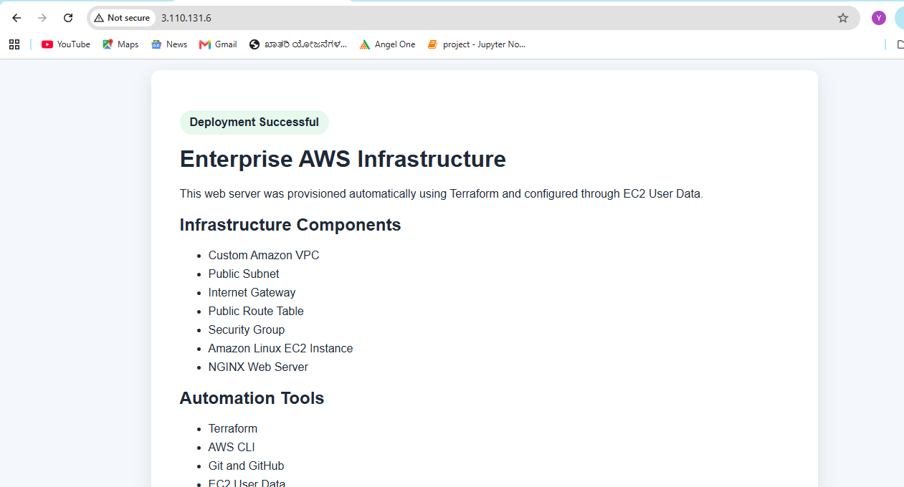

## Automated Web Server Deployment

The EC2 instance is automatically configured using an EC2 User Data script. During its first startup, the instance installs NGINX, creates a custom project webpage, and enables the service.

## Project Progress

- ✅ AWS authentication
- ✅ Terraform initialization
- ✅ Custom VPC
- ✅ Public subnet
- ✅ Internet Gateway
- ✅ Public route table
- ✅ Route table association
- ✅ Security Group
- ✅ EC2 instance
- ✅ Automated NGINX installation
- ⏳ Remote Terraform backend
- ⏳ Terraform modules
- ⏳ GitHub Actions pipeline